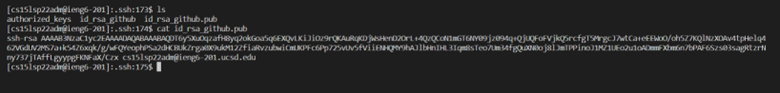

# **Lab Report 3 - Week 6**

## **Streamlining `ssh` Configuration**

Creating and editing the `.ssh/config` file:

Contents of `.ssh/config`:

`ssh` command log in using alias/shortform:

`scp` copying using an alias:

## **Setup Github Access from ieng6**

Public key stored on Github:

Content of the Public key stored in your user account:

Path of Private key on user account:

Running `git` commands to commit and push a change to Github while logged into ieng6 account:

   
Disclaimer: I had some trouble in pushing out the changes, thus the "status, add, and commit" section of the command not included in the picture.

Link for resulting commit:
[Link-For-Commit](https://github.com/Hiro-229/markdown-parser/commit/f1ee54801dffa5878867917e0b438cbf5b07f287)

## **Copy whole directories with `scp -r`**

Copying whole markdown-parse directory to ieng6 account:

Logging into ieng6 account and compiling/running the tests:

Combining `scp`, `;`, and `ssh` to copy the whole directory and run the tests as one command:

