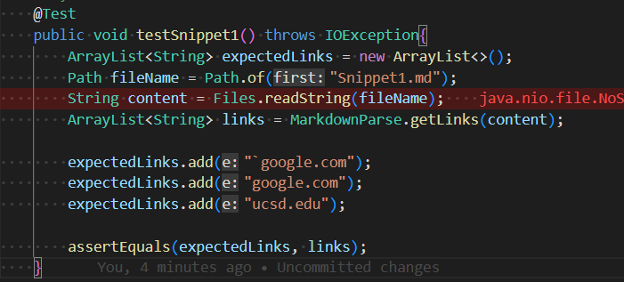
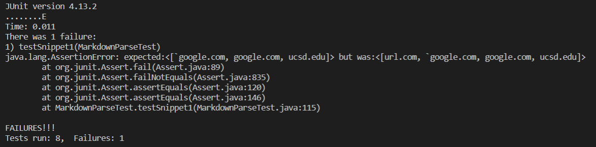
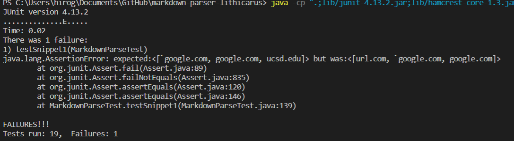
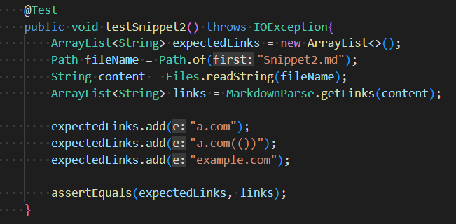
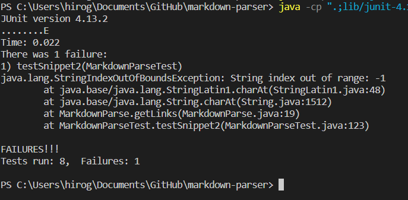
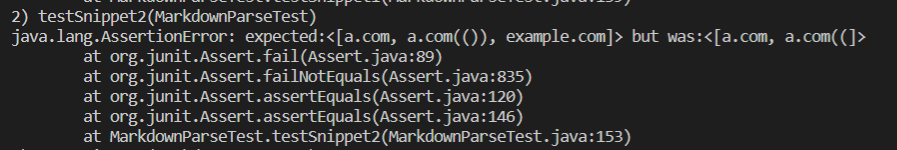
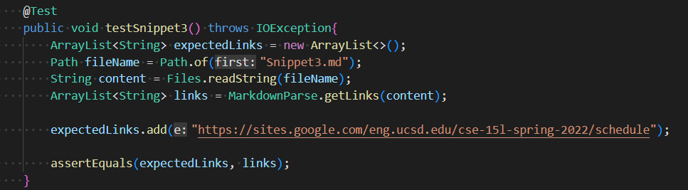
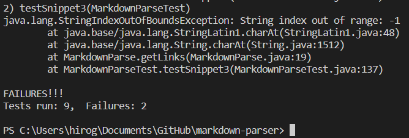
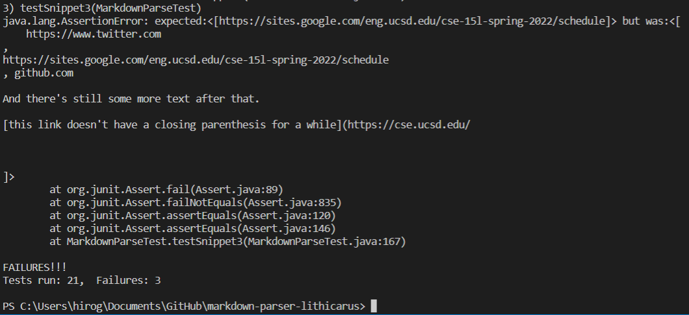

# **Lab Report 3 - Week 6**

Link to my Markdown-Parse repo:
[My-Markdown-Parse](https://github.com/Hiro-229/markdown-parser.git)

Link to the other Markdown-Parse repo: [Other-Markdown_parse](https://github.com/lithicarus/markdown-parser)    

## **Snipet 1**
---
Code in `MarkdownParseTest.java` file:   

Result of running test with my code of the `MarkdownParse.java`:    

The test did not pass.      

Result of running test with other's code of the `MarkdownParse.java`:    
 

The test did not pass.    

> Question: Do you think there is a small (<10 lines) code change that will make your program work for snippet 1 and all related cases that use inline code with backticks? If yes, describe the code change. If not, describe why it would be a more involved change.

Answer: There is a solution and I think it would be less than 10 if coded efficiently. To solve the issue with the backtick, I think it would invovle checking if the open bracket comes after the back tick. If that evcaluates to "true", then I would look for the next available open bracket and restart the process from there. Furthermore, I would need to make sure that close bracket is paired with an open bracket that comes before the index of the close bracket.       

## **Snipet 2**
---
Code in `MarkdownParseTest.java` file:

Result of running test with my code of the `MarkdownParse.java`:    

The test did not pass. Becuase it is experiencing fundamental issue of "index-out-of-bound," it means that my counter for the variables are not covering all the edge cases. I have tried to look at my groupmate's code and test if that would at least produce some actual array of the links, but it resulted to also running into errors on other basic test cases. Thus, I need to re-trace my steps to figure out the issue.      

Result of running test with other's code of the `MarkdownParse.java`:    
 

The test did not pass.    

> Question: Do you think there is a small (<10 lines) code change that will make your program work for snippet 2 and all related cases that nest parentheses, brackets, and escaped brackets? If yes, describe the code change. If not, describe why it would be a more involved change.

Answer: I am not sure if it would be contained within the 10 lines, but one way to fix this nested brackets and parentheses would be to make the code so that it counts the very first occurance and very last occurance of the open and closed bracket and parentheses, diregarding anything in between as the indicator. For example, if the passed in file has " )asdsa)  [" then I would search if there exist a closed parentheses between the first closed-parentheses and the open bracket. In the case it does exist --> I would ignore the first closed parentheses and move the index counter of the closed parentheses to the second occurence one. By repeating this process for both closed/open parentheses and brackets, it should be able to diffrentiate what is part of the link and what is the syntax. 

## **Snipet 3**
---
Code in `MarkdownParseTest.java` file:

Result of running test with my code of the `MarkdownParse.java`:    

The test did not pass. Becuase it is experiencing fundamental issue of "index-out-of-bound," it means that my counter for the variables are not covering all the edge cases. I have tried to look at my groupmate's code and test if that would at least produce some actual array of the links, but it resulted to also running into error on other basic test file. Thus, I need to re-trace my steps to figure out the issue.     

Result of running test with other's code of the `MarkdownParse.java`:    
 

The test did not pass.    

> Question: Do you think there is a small (<10 lines) code change that will make your program work for snippet 3 and all related cases that have newlines in brackets and parentheses? If yes, describe the code change. If not, describe why it would be a more involved change.

Answer: Using the other's code as reference, there should be a relative easy fix to solve the new line issues. All we have to do is when reading the content of the ".md" file, when we see a "new line" syntax, we should remove the "new-line" and re-write the link line as such. 