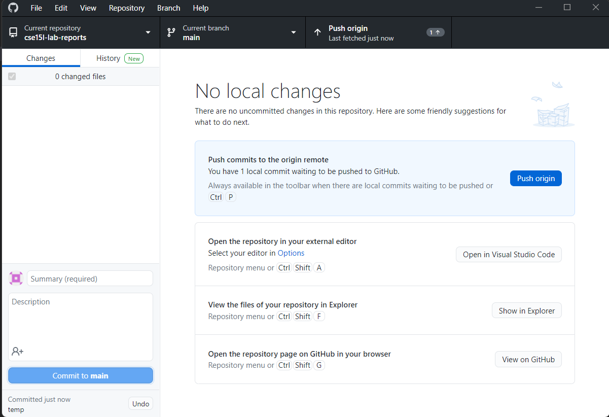
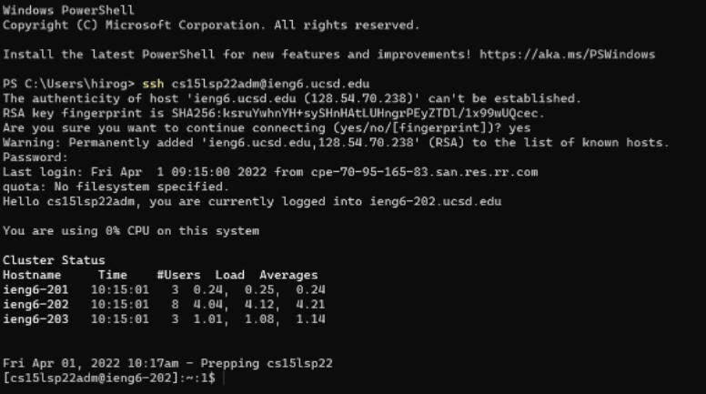
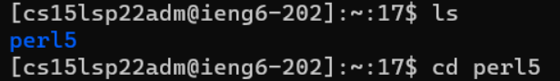
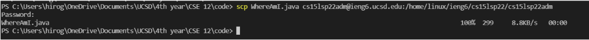
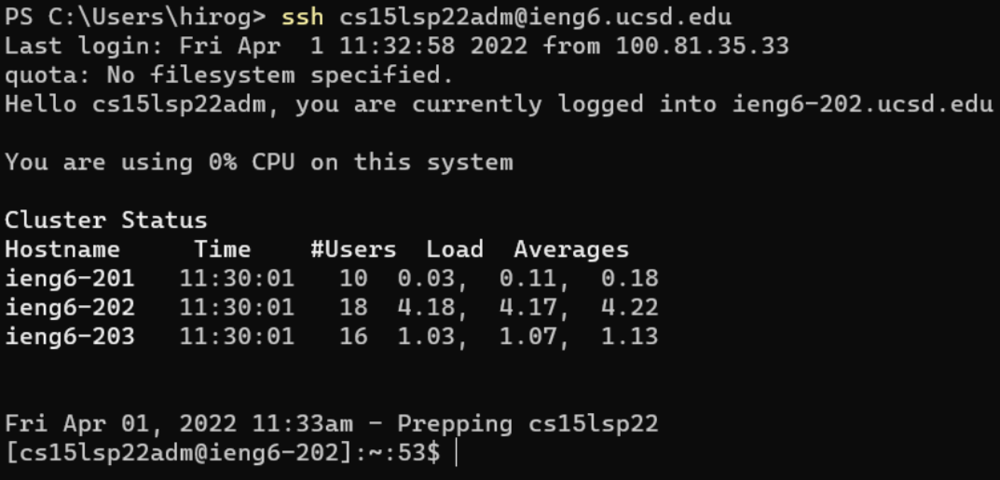
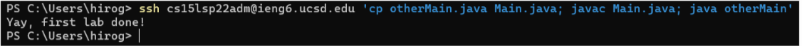

# Step 1: Install VS-Code   
     
1. Go download the VS-code that matches your operating software
2. Follow the simple guide tutorial and it will lead you up to this screen.   
3. Then you can start using the "Github Desktop" and VS-Code to start editing your markdown files and updating your pages.         
        
# Step 2: Remotely Connecting     
    
* Go to your terminal and type "ssh <"account name">@<"remote server name">
* if it's you first time loging in, it will ask you if you want continue connecting. Say "Yes."
* After that you should see the image similar to above, you have connected.

# Step 3: Try Out Some Commands     

*Here is the example of some commands that can be used in the terminal: ls, cd.*
* *"ls" basically lists out all the files in the current directory you are in.*
* *"cd <"directory name">" allows you to change into that directory and work inside that directory*       

Some other commands that can be used in the terminal are: pwd, mkdir, and cp. 
* pwd: shows you the path of a directory 
* mkdir: creates a new directory of your choosing name 
* cp: copy files 

# Step 4: Moving Files with SCP
       
* **scp** command is used to copy file from your local computer to another computer on different server 
* Structre: scp file_you_want Username@computer_server_destination:path_of_destination

# Step 5: Set SSH Key
> Purpose of this is so that you don't need to keep typing in the password to log into the remote server everytime you do ssh. In this case, the ieng6.ucsd.edu server.   
> Detailed instruction: [Instruction on Key generation](https://docs.google.com/document/d/1AO6RDoJnaWxMui-UFjEa_2bbQ4qcANpbIpPuV-awsOg/edit)

1. First, type "ssh-keygen" in the terminal. Keep pressing enter till you reach the end. You should have 2 new files created, one public and one private. 
2. log back into the server, and make a new directory named ".ssh"
3. log out and from your laptop terminal, copy the public key into the ".ssh" directory you made in the remote server
4. With all that completed, you will be able to login by using ssh key without the need to type in password (as picture above).

# Step 6: Optimization of Running Commands
When writing the commands in the terminal, you can type up multiple commands to be executed all in the same line.

*What you see here is that loging into remote server, copying of the file otherMain.Java into Main.Java, and execution of otherMain.java are all written in the same command line and are executed at once.*

